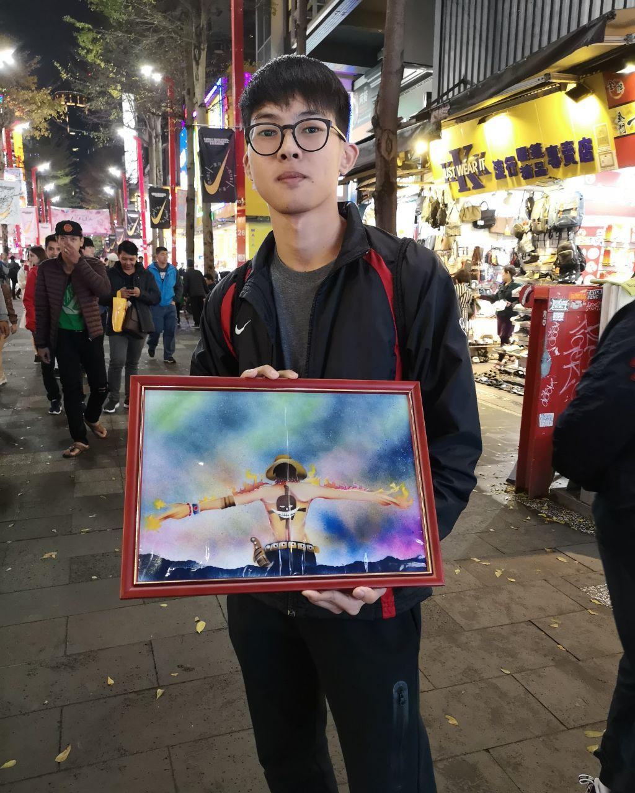
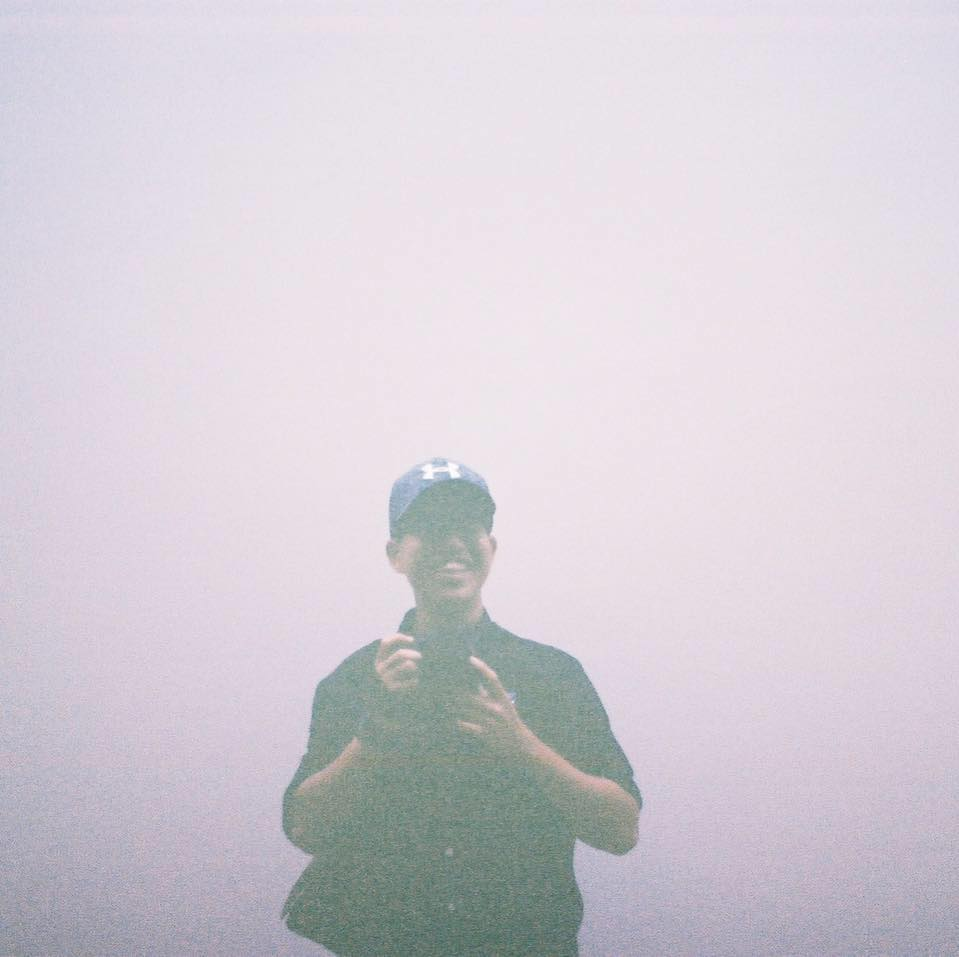

We are a team based in the [School of Computing, National University of Singapore](http://www.comp.nus.edu.sg).

You can reach us at the email `seer[at]comp.nus.edu.sg`

## Project team

### Hope Leong

[[github](https://github.com/hoperawr)]
[[portfolio](team/hoperawr.md)]

* Role: Team Lead
* Responsibilities: Scheduling and Tracking

### Chan Wa Wai

[[github](http://github.com/wayne987)]
[[portfolio](team/wayne987.md)]

* Role: Developer
* Responsibilities: Testing

### Phoon Jun Hui

[[github](http://github.com/junhui-phoon)] 
[[portfolio](team/junhui-phoon.md)]

* Role: Developer
* Responsibilities: Integration

### Ethan So

[[github](http://github.com/ethanso56)]
[[portfolio](team/ethanso56.md)]

* Role: Developer
* Responsibilities: Code Quality

### Ng Jia Xin

[[github](http://github.com/jiaax)]
[[portfolio](team/jiaax.md)]

* Role: Developer
* Responsibilities: Documentation
