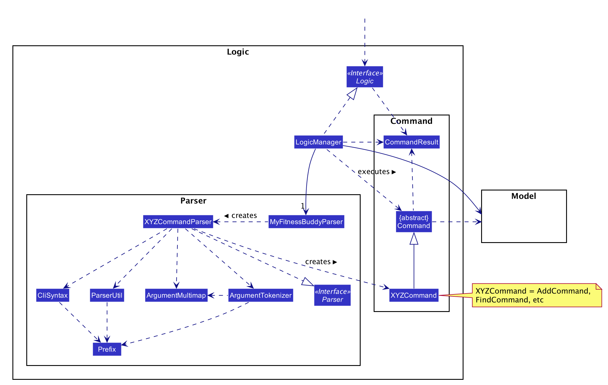
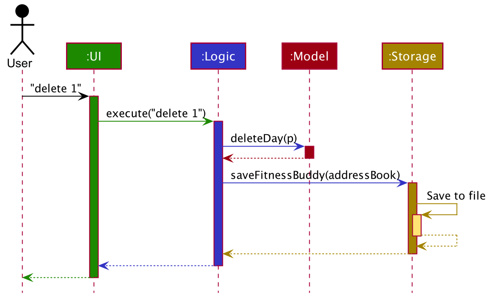
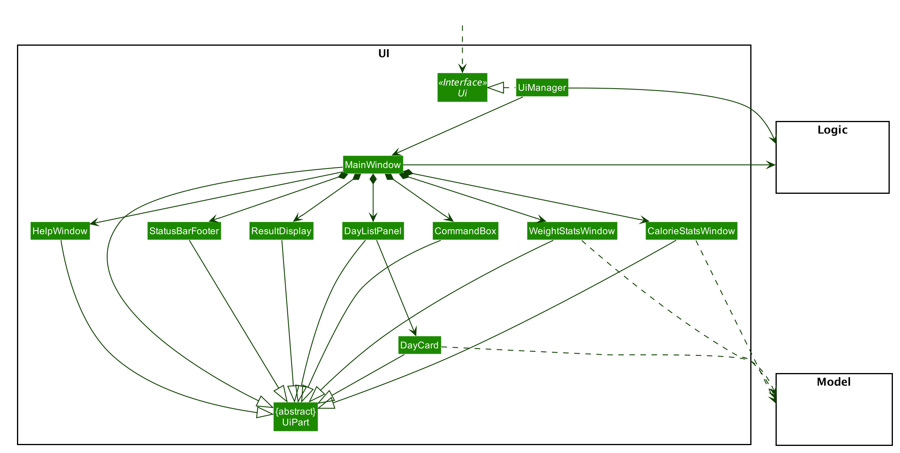
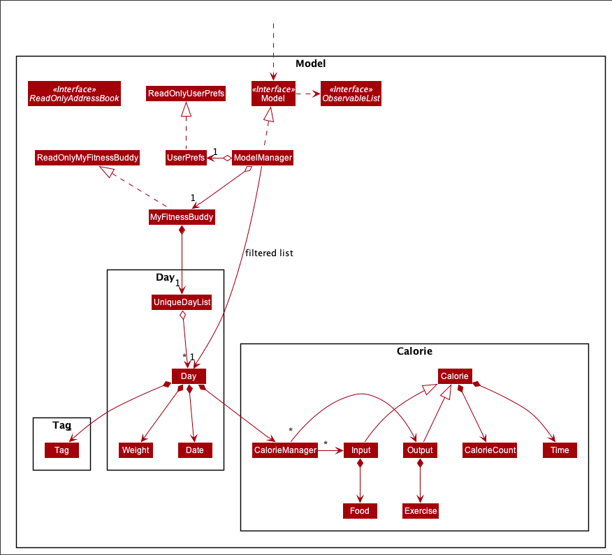
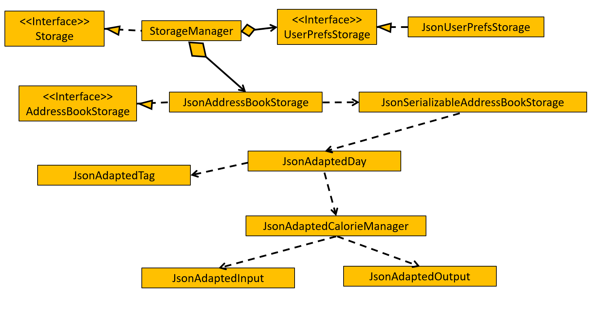
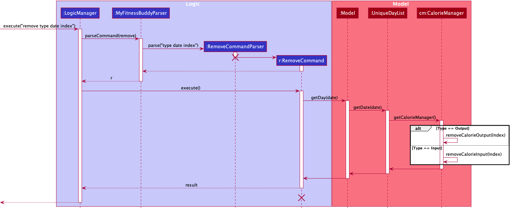

* Table of Contents
{:toc}

--------------------------------------------------------------------------------------------------------------------

## **1. Introduction**

### 1.1 About the application

My Fitness Buddy is a desktop application that helps users keep track of their weight and calorie input/output.

### 1.2 Purpose

This document specifies the architecture, implementation and design decisions for
the application, My Fitness Buddy.

### 1.3 Intended Audience

This Developer Guide is for anyone who are interested in the implementation of My Fitness Buddy,
as well as future developers that are interested in further developing of our application.

--------------------------------------------------------------------------------------------------------------------

## **2. Design**

### 2.1 Architecture

The ***Architecture Diagram*** given above explains the high-level design of the App. Given below is a quick overview of each component.

:bulb: **Tip:** The `.puml` files used to create diagrams in this document can be found in the [diagrams](https://github.com/se-edu/addressbook-level3/tree/master/docs/diagrams/) folder. Refer to the [_PlantUML Tutorial_ at se-edu/guides](https://se-education.org/guides/tutorials/plantUml.html) to learn how to create and edit diagrams.

**`Main`** has two classes called [`Main`](https://github.com/se-edu/addressbook-level3/tree/master/src/main/java/seedu/address/Main.java) and [`MainApp`](https://github.com/se-edu/addressbook-level3/tree/master/src/main/java/seedu/address/MainApp.java). It is responsible for,
* At app launch: Initializes the components in the correct sequence, and connects them up with each other.
* At shut down: Shuts down the components and invokes cleanup methods where necessary.

[**`Commons`**](#common-classes) represents a collection of classes used by multiple other components.

The rest of the App consists of four components.

* [**`UI`**](#ui-component): The UI of the App.
* [**`Logic`**](#logic-component): The command executor.
* [**`Model`**](#model-component): Holds the data of the App in memory.
* [**`Storage`**](#storage-component): Reads data from, and writes data to, the hard disk.

Each of the four components,

* defines its *API* in an `interface` with the same name as the Component.
* exposes its functionality using a concrete `{Component Name}Manager` class (which implements the corresponding API `interface` mentioned in the previous point.

For example, the `Logic` component (see the class diagram given below) defines its API in the `Logic.java` interface and exposes its functionality using the `LogicManager.java` class which implements the `Logic` interface.

**How the architecture components interact with each other**

The *Sequence Diagram* below shows how the components interact with each other for the scenario where the user issues the command `delete 1`.

The sections below give more details of each component.

### 2.2 UI component

**API** :
[`Ui.java`](https://github.com/se-edu/addressbook-level3/tree/master/src/main/java/seedu/address/ui/Ui.java)

The UI consists of a `MainWindow` that is made up of parts e.g.`CommandBox`, `ResultDisplay`, `DayListPanel`, `StatusBarFooter` etc. All these, including the `MainWindow`, inherit from the abstract `UiPart` class.

The `UI` component uses JavaFx UI framework. The layout of these UI parts are defined in matching `.fxml` files that are in the `src/main/resources/view` folder. For example, the layout of the [`MainWindow`](https://github.com/se-edu/addressbook-level3/tree/master/src/main/java/seedu/address/ui/MainWindow.java) is specified in [`MainWindow.fxml`](https://github.com/se-edu/addressbook-level3/tree/master/src/main/resources/view/MainWindow.fxml)

The `UI` component,

* Executes user commands using the `Logic` component.
* Listens for changes to `Model` data so that the UI can be updated with the modified data.

### 2.3 Logic component

**API** :
[`Logic.java`](https://github.com/AY2021S1-CS2103T-W11-3/tp/blob/master/src/main/java/seedu/address/logic/Logic.java)

1. `Logic` uses the `MyFitnessBuddyParser` class to parse the user command.
1. This results in a `Command` object which is executed by the `LogicManager`.
1. The command execution can affect the `Model` (e.g. adding a day).
1. The result of the command execution is encapsulated as a `CommandResult` object which is passed back to the `Ui`.
1. In addition, the `CommandResult` object can also instruct the `Ui` to perform certain actions, such as displaying help to the user.

Given below is the Sequence Diagram for interactions within the `Logic` component for the `execute("delete 1")` API call.

:information_source: **Note:** The lifeline for `DeleteCommandParser` should end at the destroy marker (X) but due to a limitation of PlantUML, the lifeline reaches the end of diagram.

### 2.4 Model component

**API** : [`Model.java`](https://github.com/se-edu/addressbook-level3/tree/master/src/main/java/seedu/address/model/Model.java)

The `Model`,

The model stores a `UserPref` object that represents the user’s preferences and stores My Fitness Buddy data.
The model also exposes an unmodifiable `ObservableList<Day>` that can be 'observed' e.g. the UI can be bound to this list so that the UI automatically updates when the data in the list change.  

`MyFitnessBuddy` is made up of a `UniqueDayList` which contains a list of `Day` objects. The `Day` class contains a `Date` and uses `CalorieManager` class as a data structure to store calorie `Input` and `Output`. `CalorieManager` also keeps track and can return the total calorie input and output. 

The `Calorie` class contains a `Time` and `CalorieCount` which `Input` and `Output` inherits from.  `Input` contains an additional `Food` while `Output` contains an addition `Exercise`.

`CalorieManager` is used by `Day` as a data structure to contain `Input` and `Output`. It also keeps track and can return the total calorie input and output. 

### 2.5 Storage component

**API** : [`Storage.java`](https://github.com/se-edu/addressbook-level3/tree/master/src/main/java/seedu/address/storage/Storage.java)

The `Storage` component,
* can save `UserPref` objects in json format and read it back.
* can save My Fitness Buddy data in json format and read it back.

### 2.6 Common classes

Classes used by multiple components are in the `seedu.addressbook.commons` package.

--------------------------------------------------------------------------------------------------------------------

## **3. Implementation**

This section describes some noteworthy details on how certain features are implemented.

### Remove Calorie feature

#### Implementation

This feature allows user to remove a certain calorie from a particular day.

The mechanism utilises the RemoveCommandParser Class to parse the input into `Type of Calorie` to be remove, `Date` of the
day in which the calorie is in and `Index` of the particular calorie to be removed in the list. 

It than utilise the RemoveCommand class to execute the actual removal of the calorie. It will call the method `getDate` which uses `Date` to locate the Day class
from the uniqueDayList in which the calorie resides in and returns it.

The CalorieManager of the particular Day class will then be retrieved using the `getCalorieManager` method to make the relevant changes. 
CalorieManager contains a list of Input Calories and a list of Output Calories.

Finally,`Type of Calorie` is then used to determined which list the calorie to be removed is in. It will utilise 
the CalorieManager method `removeCalorieOutput` or `removeCalorieInput` depending on `Type of Calorie`. The method will than use `Index`
to remove the calorie at the specific index in the corresponding list of Calories. 

### View Statistics feature

#### Implementation

This feature allows users to view their daily calorie input, 
calorie output and weight in the form of a line chart generated using JavaFX
`LineChart` and `XYChart`.

The mechanism utilises the `Logic#getFilteredDayList` method to get all
daily records of calorie input/output and weight to be used
as data points and axis of the chart. 

It also utilises JavaFX `ListChangeListner` to listen for any changes
to the list when the user adds or modifies any data, and updates the chart 
instantly.

This feature comprises the `CalorieStatsWindow` and `WeightStatsWindow` classes
and have the same behaviour, with the only difference is the type of data (calorie input/output, weight)
used to generate the chart. Given below is a diagram...

_{Diagram to be added}_

### View all calorie inputs and calorie outputs of a day feature

#### Implementation

This feature allows users to view each of their calorie inputs and calorie 
outputs for a particular day when that day is double clicked. When a `DayCard` gets 
double clicked, the `MainWindow#fillCaloriePlaceHolders` method gets called. The 
list of calorie inputs and calorie outputs of that day would be then used to fill up 
the JavaFX `ListView`. The `ListView` is then used to replace the placeholders on the 
right side of the app in `MainWindow`. 

{More details to be added in terms of updating the list when a new calorie is added}

_{Diagram to be added}_

### Creates a new Person to My Fitness Buddy

#### Implementations

This feature allows users to create a new `Profile`, consisting of their *Name*, *ID*, *Height* and *TargetWeight*,
and a new `UniqueDayList` for daily calorie entries. Upon initialising My Fitness Buddy application, a default `Person` object 
will be created and its `Profile` will be recreated by users. Once the profile has been set for `Person`, the user can now add
daily entries to My Fitness Buddy's `UniqueDayList`. 

_{Diagram to be added}_

### Edits a profile in My Fitness Buddy

#### Implementations

This feature allows users to edit an existing `Profile`, consisting of their *Name*, *ID*, *Height* and *TargetWeight*.
`UniqueDayList` that records the daily entries will remain unchanged.

{More details to be added in terms of updating the profile in the next iteration}

_{Diagram to be added}_

### \[Proposed\] Undo/redo feature

#### Proposed Implementation

The proposed undo/redo mechanism is facilitated by `VersionedAddressBook`. It extends `AddressBook` with an undo/redo history, stored internally as an `addressBookStateList` and `currentStatePointer`. Additionally, it implements the following operations:

* `VersionedAddressBook#commit()` — Saves the current address book state in its history.
* `VersionedAddressBook#undo()` — Restores the previous address book state from its history.
* `VersionedAddressBook#redo()` — Restores a previously undone address book state from its history.

These operations are exposed in the `Model` interface as `Model#commitAddressBook()`, `Model#undoAddressBook()` and `Model#redoAddressBook()` respectively.

Given below is an example usage scenario and how the undo/redo mechanism behaves at each step.

Step 1. The user launches the application for the first time. The `VersionedAddressBook` will be initialized with the initial address book state, and the `currentStatePointer` pointing to that single address book state.

Step 2. The user executes `delete 5` command to delete the 5th day in My Fitness Buddy. The `delete` command calls `Model#commitAddressBook()`, causing the modified state of My Fitness Buddy after the `delete 5` command executes to be saved in the `addressBookStateList`, and the `currentStatePointer` is shifted to the newly inserted address book state.

Step 3. The user executes `add n/David …​` to add a new day. The `add` command also calls `Model#commitAddressBook()`, causing another modified address book state to be saved into the `addressBookStateList`.

:information_source: **Note:** If a command fails its execution, it will not call `Model#commitAddressBook()`, so My Fitness Buddy state will not be saved into the `addressBookStateList`.

Step 4. The user now decides that adding the day was a mistake, and decides to undo that action by executing the `undo` command. The `undo` command will call `Model#undoAddressBook()`, which will shift the `currentStatePointer` once to the left, pointing it to the previous address book state, and restores My Fitness Buddy to that state.

:information_source: **Note:** If the `currentStatePointer` is at index 0, pointing to the initial AddressBook state, then there are no previous AddressBook states to restore. The `undo` command uses `Model#canUndoAddressBook()` to check if this is the case. If so, it will return an error to the user rather
than attempting to perform the undo.

The following sequence diagram shows how the undo operation works:

:information_source: **Note:** The lifeline for `UndoCommand` should end at the destroy marker (X) but due to a limitation of PlantUML, the lifeline reaches the end of diagram.

The `redo` command does the opposite — it calls `Model#redoAddressBook()`, which shifts the `currentStatePointer` once to the right, pointing to the previously undone state, and restores My Fitness Buddy to that state.

:information_source: **Note:** If the `currentStatePointer` is at index `addressBookStateList.size() - 1`, pointing to the latest address book state, then there are no undone AddressBook states to restore. The `redo` command uses `Model#canRedoAddressBook()` to check if this is the case. If so, it will return an error to the user rather than attempting to perform the redo.

Step 5. The user then decides to execute the command `list`. Commands that do not modify My Fitness Buddy, such as `list`, will usually not call `Model#commitAddressBook()`, `Model#undoAddressBook()` or `Model#redoAddressBook()`. Thus, the `addressBookStateList` remains unchanged.

Step 6. The user executes `clear`, which calls `Model#commitAddressBook()`. Since the `currentStatePointer` is not pointing at the end of the `addressBookStateList`, all address book states after the `currentStatePointer` will be purged. Reason: It no longer makes sense to redo the `add n/David …​` command. This is the behavior that most modern desktop applications follow.

The following activity diagram summarizes what happens when a user executes a new command:

#### Design consideration:

##### Aspect: How undo & redo executes

* **Alternative 1 (current choice):** Saves the entire address book.
  * Pros: Easy to implement.
  * Cons: May have performance issues in terms of memory usage.

* **Alternative 2:** Individual command knows how to undo/redo by
  itself.
  * Pros: Will use less memory (e.g. for `delete`, just save the day being deleted).
  * Cons: We must ensure that the implementation of each individual command are correct.

_{more aspects and alternatives to be added}_

### \[Proposed\] Data archiving

_{Explain here how the data archiving feature will be implemented}_

--------------------------------------------------------------------------------------------------------------------

## **4. Documentation, logging, testing, configuration, dev-ops**

* [Documentation guide](Documentation.md)
* [Testing guide](Testing.md)
* [Logging guide](Logging.md)
* [Configuration guide](Configuration.md)
* [DevOps guide](DevOps.md)

--------------------------------------------------------------------------------------------------------------------

## **5. Appendix: Requirements**

### Product scope

**Target user profile**:

* has a need to manage their calorie input and weight loss
* prefer desktop apps over other types
* can type fast
* prefers typing to mouse interactions
* is reasonably comfortable using CLI apps

**Value proposition**: manages weight loss/gain and calorie input/output faster than a typical mouse/GUI driven app

### User stories

Priorities: High (must have) - `* * *`, Medium (nice to have) - `* *`, Low (unlikely to have) - `*`

| Priority | As a …​                                    | I want to …​                     | So that I can…​                                                        |
| -------- | ------------------------------------------ | ------------------------------ | ---------------------------------------------------------------------- |
| `* * *`  | new user                                   | create a new profile         | set up the application |
| `* * *`  | user                                       | record my daily weight         | keep track of them   |
| `* * *`  | user                                       | record meals and the amount of calorie eaten  | keep track of them |
| `* * *`  | user                                       | record exercises and the amount of calories lost | keep track of them |
| `* * *`  | user                                       | view my calorie history   | see if I am hitting my calorie targets |
| `* * *`  | user                                       | view all my daily weights | see if I am hitting my weight targets | 
| `* * *`  | user                                       | delete a specified calorie output | remove a wrong input |
|  `* * *` | user                                       | delete a specified calorie input | remove a wrong output |

*{More to be added}*

### Use cases

(For all use cases below, the **System** is the `MyFitnessBuddy` and the **Actor** is the `user`, unless specified otherwise)

**Use case: Add a daily weight record**

**MSS**
1.  User requests to add a weight record
2.  User inputs the date and weight
3.  User sees the newly added weight record of the day.
    
    Use case ends.
    
**Use case: Edit a daily weight record**

**MSS**
1.  User requests to edit a weight record
2.  User inputs the index of the record and weight
3.  User sees the newly edited weight record of the day.
    
    Use case ends.

**Use case: Add a calorie input**

**MSS**

1.  User requests to add calorie input
2.  User selects the date that he/she wants to add a calorie input
3.  User inputs the calorie input
4.  User sees the newly updated calorie input of the day

    Use case ends.
    
**Use case: View calorie history**

**MSS**

1.  User requests to view calorie history
2.  User sees his/her calorie history

    Use case ends.

**Extensions**

* 2a. The history is empty.

  Use case ends.

*{More to be added}*

### Non-Functional Requirements

1.  Should work on any _mainstream OS_ as long as it has Java `11` or above installed.
2.  Should be able to hold up to 100 days of calorie input/output without a noticeable sluggishness in performance for typical usage.
3.  A user with above average typing speed for regular English text (i.e. not code, not system admin commands) should be able to accomplish most of the tasks faster using commands than using the mouse.

*{More to be added}*

### Glossary

* **Mainstream OS**: Windows, Linux, Unix, OS-X
* **Calorie Input**: The amount of energy eaten from food eaten by the user
* **Calorie Output**: The amount of energy used by the user from exercises
* **Calorie History**: A collection of calorie input and output for the past months
* **Daily Weight**: The weight of the user for a specific day

--------------------------------------------------------------------------------------------------------------------

## **6. Appendix: Instructions for manual testing**

Given below are instructions to test the app manually.

:information_source: **Note:** These instructions only provide a starting point for testers to work on;
testers are expected to do more *exploratory* testing.

### Launch and shutdown

1. Initial launch

   1. Download the jar file and copy into an empty folder

   1. Double-click the jar file Expected: Shows the GUI with a set of sample contacts. The window size may not be optimum.

1. Saving window preferences

   1. Resize the window to an optimum size. Move the window to a different location. Close the window.

   1. Re-launch the app by double-clicking the jar file. 
       Expected: The most recent window size and location is retained.

1. _{ more test cases …​ }_

### Deleting a day

1. Deleting a day while all days are being shown

   1. Prerequisites: List all days using the `list` command. Multiple days in the list.

   1. Test case: `delete 1` 
      Expected: First contact is deleted from the list. Details of the deleted contact shown in the status message. Timestamp in the status bar is updated.

   1. Test case: `delete 0` 
      Expected: No day is deleted. Error details shown in the status message. Status bar remains the same.

   1. Other incorrect delete commands to try: `delete`, `delete x`, `...` (where x is larger than the list size) 
      Expected: Similar to previous.

1. _{ more test cases …​ }_

### Saving data

1. Dealing with missing/corrupted data files

   1. _{explain how to simulate a missing/corrupted file, and the expected behavior}_

1. _{ more test cases …​ }_
