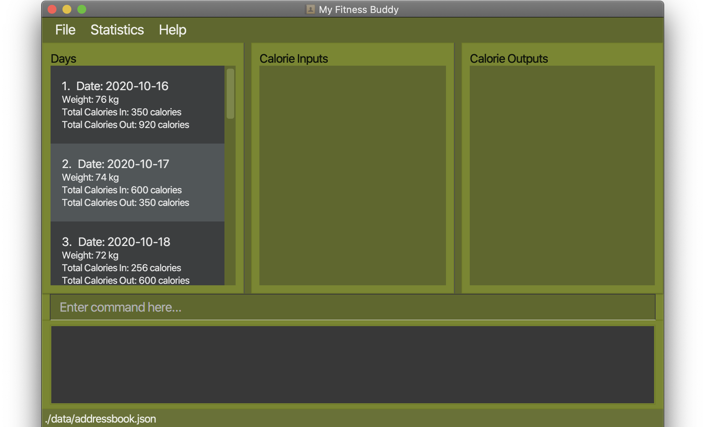
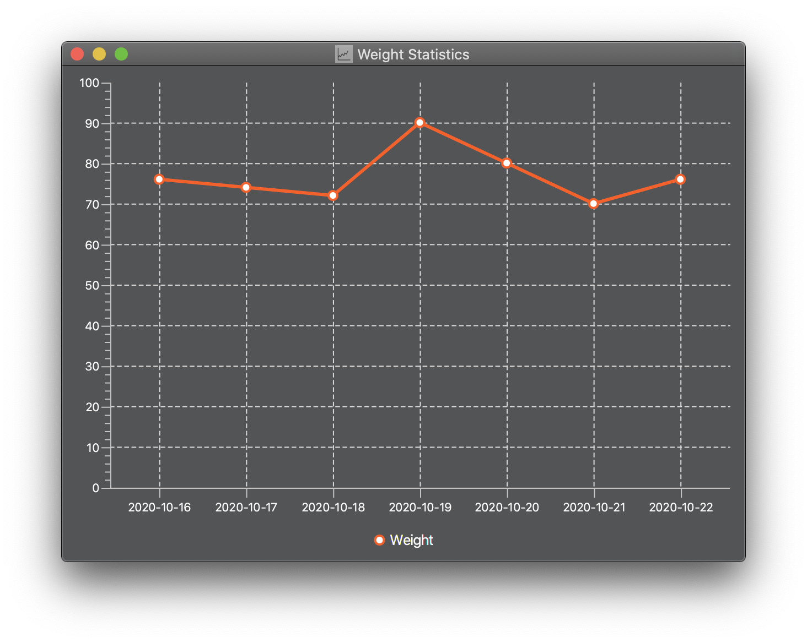
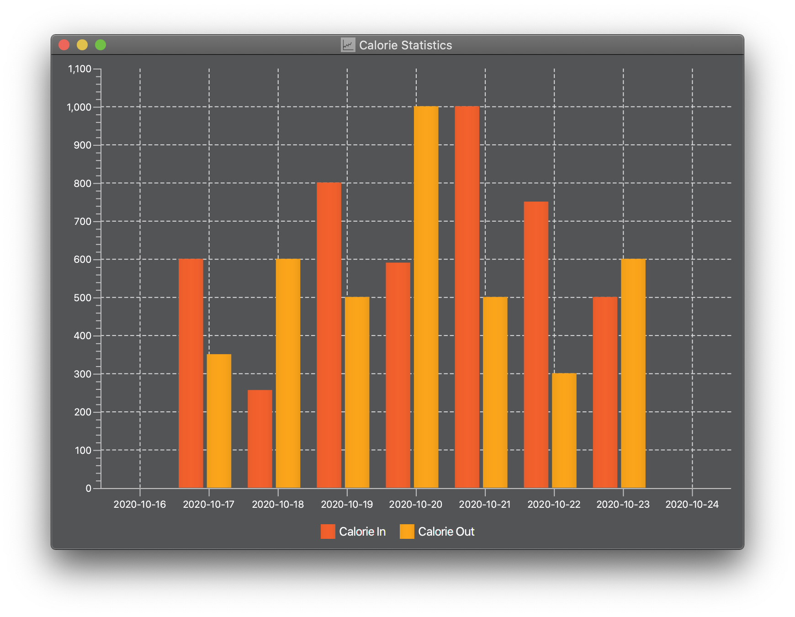
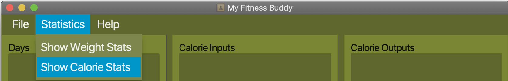
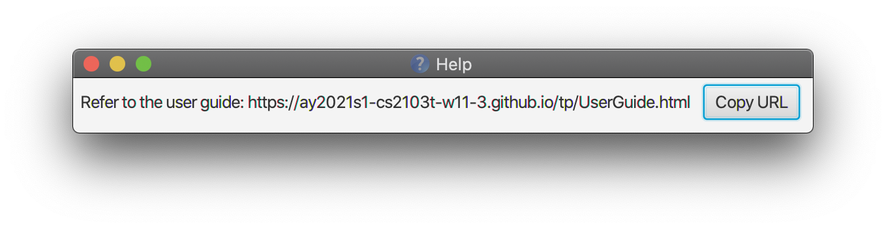

Welcome to My Fitness Buddy User Guide! Choose a topic from the [Table of Contents](#table-of-contents)
below to get step-by-step instructions and answers.

## Table of Contents
* Table of Contents
{:toc}

--------------------------------------------------------------------------------------------------------------------

## 1. Introduction

### 1.1 Product overview

My Fitness Buddy `v1.3` is a desktop application that helps you to track 
your overall change in fitness level by managing your daily calorie input/output and weight changes during Basic Military 
Training (BMT).

You can add daily records of your weight and calorie input/output into the application. My Fitness Buddy will generate
visual charts based on these records so that you can monitor your daily progress and make better choices to
achieve your goals.

--------------------------------------------------------------------------------------------------------------------

## 2. About

### 2.1 Purpose

This document specifies the quick start guide, features and the command summary of
the application, My Fitness Buddy.

### 2.2 Intended Audience

This User Guide is for any Full-Time National Servicemen that uses the MyFitnessBuddy application.

--------------------------------------------------------------------------------------------------------------------

## 3. Getting Started

Thank you for using My Fitness Buddy! Here's a quick start guide to get you started.

1. Ensure you have Java 11 or above installed in your Computer. 
1. Download the latest *MyFitnessBuddy_`v1.3`*.jar [here](https://github.com/AY2021S1-CS2103T-W11-3/tp/releases)
1. Copy the file to the folder you want to use as the *home folder* for My Fitness Buddy.  
1. Double-click the file to start the app. The GUI similar to the below should appear in a few seconds.
                   
1. If the app doesn’t start right away, try opening a command terminal in the folder and enter  
`java -jar MyFitnessBuddy.jar`
1. You can type a command in the command box and press <kbd>Enter</kbd> to execute it. 
Here are some basic commands you can try:
    * `create n/Johnny id/1234 h/170 w/68`: Creates a profile named `Johnny`.
    * `add d/2020-10-16 w/70`: Creates a daily record with the specified date and weight.
    * `calorie d/2020-10-26 tp/in t/1200 f/laksa c/290`: Adds a calorie input entry with the specified date.
    * `stats v/all`: View both calorie and weight charts in a pop-up window.

1. Head to [Features](#4-features) below to learn more details of each command. 

--------------------------------------------------------------------------------------------------------------------

## 4. Features

**Notes about the command format:**  

* Words in `UPPER_CASE` are the parameters to be supplied by the user.
	* e.g. in `add f/FOOD`, `FOOD` is a parameter and should be replaced with the name of the food like `f/Laksa`

### 4.1 Profile commands

#### 4.1.1 Creating a new profile : `create`
Create a new profile for a Person.

Format: `create n/NAME id/ID_NUM h/HEIGHT w/TARGET_WEIGHT`

Examples:  
`create n/Johnny id/1234 h/170 w/68` 

#### 4.1.2 Editing an existing profile: `profile edit`
Edit an existing profile.

Format: `profile edit n/NAME id/ID_NUM h/HEIGHT w/TARGET_WEIGHT`

Examples:
`profile edit n/John id/1233 h/170 w/70`

### 4.2 Day commands

#### 4.2.1 Adding a daily weight record : `add d/DATE w/WEIGHT`
Add a new daily weight record.

Format: `add d/DATE w/WEIGHT`

Examples:  
`add d/2020-10-16 w/70` 

#### 4.2.2 Editing a daily weight record : `edit INDEX w/WEIGHT`
Edit a daily weight record.

Format: `edit INDEX w/WEIGHT`

Examples:  
`edit 1 w/65` 

#### 4.2.3 Deleting a daily record: `delete INDEX`
Deletes a daily record at INDEX.

Format: `delete INDEX`

Examples:
`delete 2`

### 4.3 Calorie Commands
Commands in this section are useful in keeping track of the various calorie content.
You can use them to log different kinds of calorie content and their relevant information.

There are two main types of calorie that you can keep of : Input and Output
Calorie.

Each of them consist of three main components as summarized below.

INPUT CALORIE | OUTPUT CALORIE
--------------|---------------
tp/in         |tp/out
t/            |t/
f/            |e/
c/            |c/

The table below summarizes the various prefix relevant for this section
and their corresponding meaning.

Prefix | Meaning
--------|------------------
**tp/** | `type of calorie`
**t/** | `time`
**f/** | `food`
**e/** | `exercise`
**c/** | `calorie count`
**i/** | `index`
**d/** | `date`

#### 4.3.1 Adding Calorie
##### 4.3.1.1 Adding a calorie input : `calorie tp/in`

Add calorie input to the calorie tracker.

Format: `calorie tp/in d/DATE t/TIME f/FOOD c/CALORIE COUNT`

Examples:`calorie d/2020-10-26 tp/in t/1200 f/laksa c/290` 

Meaning:`The user ate laksa with the calorie count of 290kcal at 12pm on the date October 26 2020` 

_TIP: If the `DATE` field is left empty, the calorie input will be added to the current date entry._

##### 4.3.1.2 Adding a calorie output : `calorie tp/out`
Add calorie output to the calorie tracker.

Format: `calorie tp/out d/DATE t/TIME e/EXERCISE c/CALORIE COUNT`

Examples:`calorie d/2020-10-26 tp/in t/1200 e/running c/400` 

Meaning:`The user ran on October 26 2020 at 12pm and has expanded 400kcal` 

_TIP: If the `DATE` field is left empty, the calorie output will be added to the current date entry._

#### 4.3.2 Removing Calorie
##### 4.3.2.1 Removing a calorie input : `remove tp/in`

Removes a wrong calorie input entry from the calorie tracker.

Format: `remove tp/in d/DATE i/INDEX`

Examples:`remove tp/in d/2020-10-26 i/3` 

Meaning:`Remove a calorie input from October 26 2020 calorie log, which is the 3rd calorie input in the list of
Input calories for that day.` 

_TIP: Instead of using d/DATE to specify the date of the log in which the calorie belongs too, the index of the date
can be used instead_

Example:`remove 3 tp/in i/3` 

##### 4.3.2.2 Removing a calorie output : `remove tp/out`

Removes a wrong calorie Output entry from the calorie tracker.

Format: `remove tp/out d/DATE i/INDEX`

Examples:`remove tp/in d/2020-10-26 i/3` 

Meaning:`Remove a calorie output from October 26 2020 calorie log, which is the 3rd calorie output in the list of
Output calories for that day.` 

_TIP: Instead of using d/DATE to specify the date of the log in which the calorie belongs too, the index of the date
can be used instead_

Examples:`remove 3 tp/out i/3` 

#### 4.3.3 Modifying Calorie
##### 4.3.3.1 Modifying a calorie input : `modify tp/in`

Modify a calorie input entry with details recorded wrongly

Format: `modify d/DATE tp/in i/INDEX [Updated Details]`

Examples:`modify d/2020-10-26 tp/in i/2 c/123` 

Meaning:`change the calorie count of an input calorie in the log from October 26 2020 with the index of 2 in the
input list to 123` 

`Input[ Time:... Food:... CalorieCount: 9000` ]--after modification-->  `Input:[ Time:... Food:... CalorieCount: 123 ]`

_TIP: Instead of using d/DATE to specify the date of the log in which the calorie belongs too, the index of the date
can be used instead_
Examples:`modify 3 tp/out i/3 c/123`

##### 4.3.3.2 Modifying a calorie output : `modify tp/out`

Modify a calorie out entry with details recorded wrongly

Format: `modify d/DATE tp/in i/INDEX [Updated Details]`

Examples:`modify d/2020-10-26 tp/in i/2 c/123` 

Meaning:`change the calorie count of an Output calorie in the October 26 2020 log ,with the index of 2 in the
output list to 123` 

`Input[ Time:... Exercise:... CalorieCount: 9000` ]--after modification-->  `Input:[ Time:... Exercise:... CalorieCount: 123 ]`

_TIP: Instead of using d/DATE to specify the date of the log in which the calorie belongs too, the index of the date
can be used instead_

### 4.4 Data Visualization
#### 4.4.1 View all calorie inputs and outputs of a day: `Double click on a day`
Shows a list of all entries of calorie inputs and calorie outputs of a particular day.

Image: `image to be added`

#### 4.4.2 View Statistics: `stats`

Shows the charts generated from the daily entries of weight and calorie input/output in a pop-up window.

Format: `stats v/[CHART_TO_BE_VIEWED]`

You can select which charts to view:

Prefix/Parameter | Meaning
-----------------|------------------
**v/all**        | `Shows both weight and calorie charts`
**v/calorie**    | `Shows calorie chart only`
**v/weight**     | `Shows weight chart only`

Example: `stats v/all`

Weight Chart:

Calorie Chart:

_TIP: Charts can be viewed alternatively by going to the menu bar, click on `Statistics` and select the 
 chart that you want to view._

### 4.5 General commands
#### 4.5.1 Viewing help : `help`

Shows a message explaining how to access the help page.

Format: `help`

#### 4.5.2 Clearing all entries : `clear`
Clears all saved entries in MyFitnessBuddy.

Format: `clear`

#### 4.5.3 Exiting the program : `exit`
Exits the program.

Format: `exit`

### 4.6 Saving the data

My Fitness Buddy data are saved in the hard disk automatically after any command that changes the data. There is no need to save manually.

--------------------------------------------------------------------------------------------------------------------

## 5. FAQ
### 5.1 Transferring Data

**Q**: How do I transfer my data to another Computer? 
**A**: Install the app in the other computer and overwrite the empty data file it creates with the file that contains the data of your previous My Fitness Buddy home folder.  

--------------------------------------------------------------------------------------------------------------------

## 6. Command summary

Action | Format
--------|------------------
**Create profile** | `create n/NAME id/ID_NUM h/HEIGHT w/TARGET_WEIGHT` 
**Edit profile** | `profile edit n/NAME id/ID_NUM h/HEIGHT w/TARGET_WEIGHT`
**Add day record** | `add d/DATE w/WEIGHT` 
**Edit day record** | `edit INDEX w/WEIGHT`
**Delete day record** | `delete INDEX`
**Add input** | `calorie tp/in t/TIME f/FOOD c/CALORIE_COUNT`
**Add output** | `calorie tp/out t/TIME d/DURATION c/CALORIE_BURNT`
**Remove input** | `remove tp/in d/DATE i/INDEX` 
**Remove output** | `remove tp/out d/DATE i/INDEX` 
**Modify input** | `modify tp/in t/TIME f/FOOD c/CALORIE_COUNT`
**Modify output** | `modify tp/out t/TIME d/DURATION c/CALORIE_BURNT` 
**Clear entries** | `clear`
**Help** | `help`
**Exit** | `exit`

