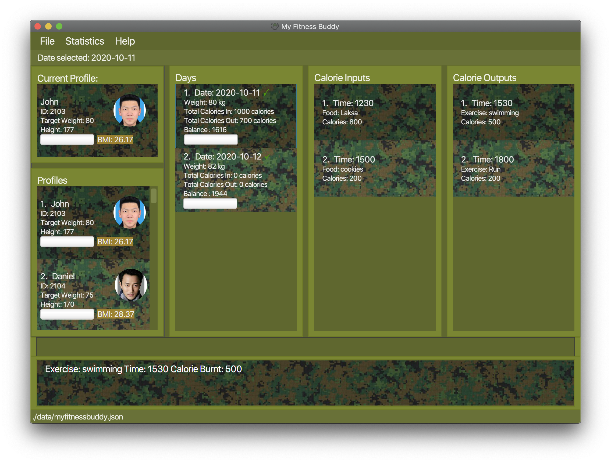

My Fitness Buddy is a desktop application that helps you to track your overall change in fitness level by allowing you to add daily records of your weight and calorie input/output.  
My Fitness Buddy also allows users to create a profile and can generate visual charts based on these records so that you can monitor your daily progress and help you achieve your goals.  
This application is optimized for use through a *Command Line Interface (CLI)*, meaning that you operate the application by typing commands into a command box.

* If you are interested in using MyFitnessBuddy, head over to the [_Getting Started_ section of the **User Guide**](UserGuide.html#3-getting-started).
* If you are interested about developing MyFitnessBuddy, the [**Developer Guide**](DeveloperGuide.html) is a good place to start.

**Acknowledgements**

* Libraries used: [JavaFX](https://openjfx.io/), [Jackson](https://github.com/FasterXML/jackson), [JUnit5](https://github.com/junit-team/junit5)
